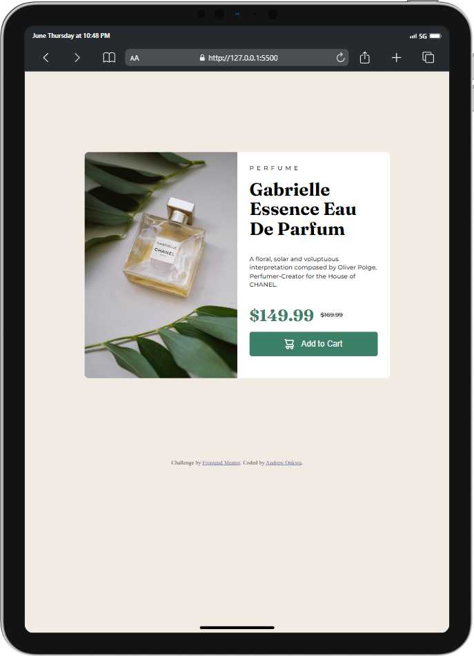
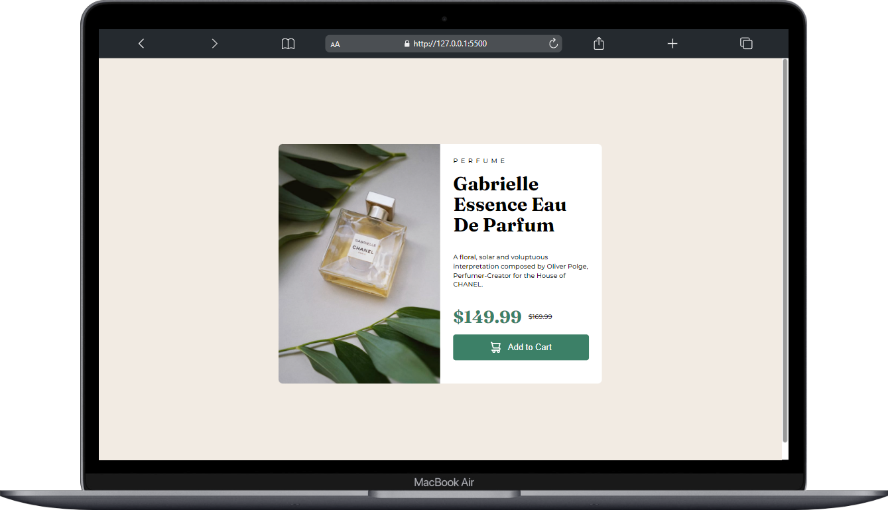

# Frontend Mentor - Product preview card component solution

This is a solution to the [Product preview card component challenge on Frontend Mentor](https://www.frontendmentor.io/challenges/product-preview-card-component-GO7UmttRfa). Frontend Mentor challenges help you improve your coding skills by building realistic projects.

## Table of contents

- [Overview](#overview)
  - [The challenge](#the-challenge)
  - [Screenshot](#screenshot)
  - [Built with](#built-with)
  - [What I learned](#what-i-learned)
  - [Continued development](#continued-development)
- [Author](#author)
- [Acknowledgments](#acknowledgments)

**Note: Delete this note and update the table of contents based on what sections you keep.**

## Overview

### The challenge

Users should be able to:

- View the optimal layout depending on their device's screen size
- See hover and focus states for interactive elements

### Screenshot

- Solution URL: [Add solution URL here](https://github.com/andychuks51/product-preview-card-component-main)
- Live Site URL: [Add live site URL here](https://andychuks51.github.io/product-preview-card-component-main/)

### Built with

- Semantic HTML5 markup

### What I learned

learnt how to create fluid a.

### Continued development

I will continue to develop my skills by working on more projects.

## Author

- Frontend Mentor - [@andy.chuks51](https://www.frontendmentor.io/profile/andychuks51)
- Twitter - [@andy.chuks51](https://x.com/drew_techie?t=UtWIzwv2An_piRX-6OoeiA&s=09)

## Acknowledgments

I give almighty God the praise for giving me the opportunity to complete this challenge and I also appreciate Frontend Mentors for providing this opportunity for me to develop my skill... I say a million thank you. ❤️
